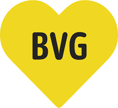
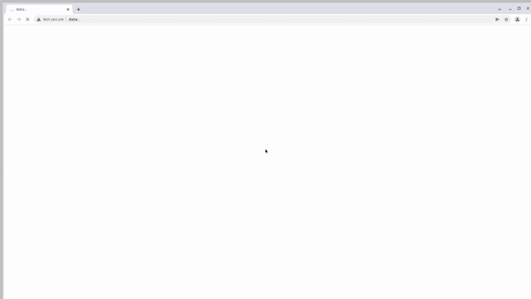

# Автоматизация тестирования заказа билета на сайте https://abo.bvg.de/de/

## :link: <a target="_blank" href="https://abo.bvg.de/de/">bvg.de - BVG Abo online abschließen | BVG</a>

<p align="center">

</p>

## :page_with_curl: Содержание:

- <a href="#computer-Технологии-и-инструменты">Технологии и инструменты</a>
- <a href="#robot-сборки-в-Jenkins">Сборки в Jenkins</a>
- <a href="#keyboard-запуск-из-терминала">Запуск из терминала</a>
- <a href="#bar_chart-allure-отчет">Allure отчет</a>
- <a href="#robot-отчет-в-telegram">Отчет в Telegram</a>
- <a href="#film_projector-видео-пример-прохождения-тестов">Видео пример прохождения тестов</a>

## :computer: Технологии и инструменты

<p align="left"> 


</p>

## :keyboard: Запуск из терминала

Локальный запуск всех тестов:

```
gradle clean abotests
```

Удаленный запуск всех тестов:

```
gradle clean
abotests
-Dbrowser=${BROWSER}
-DanyText="${ANY_TEXT}"
-Dsize="${SIZE}"
-Dversion="${VERSION}"
```

## :robot: Сборки в Jenkins

### <a target="_blank" href="https://jenkins.autotests.cloud/job/qa_guru_Jenkinsjob_MyUIDiploma/">Параметризированная сборка в Jenkins со всеми тестами</a>

<p align="center">

</p>


<p align="center">

</p>

## :bar_chart: Allure отчет

- ### Главный экран отчета

<p align="center">

</p>

- ### Страница с проведенными тестами

<p align="center">

</p>

## :robot: Отчет в Telegram

- ### Telegram notification message (all results)

<p align="center">

</p>

## :film_projector: Видео пример прохождения тестов

> К каждому тесту в отчете прилагается видео. Одно из таких видео представлено ниже.
<p align="center">
  
</p>
